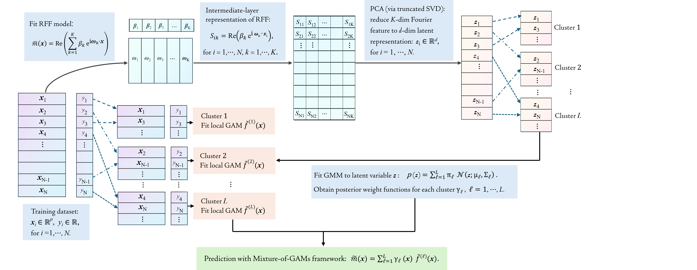
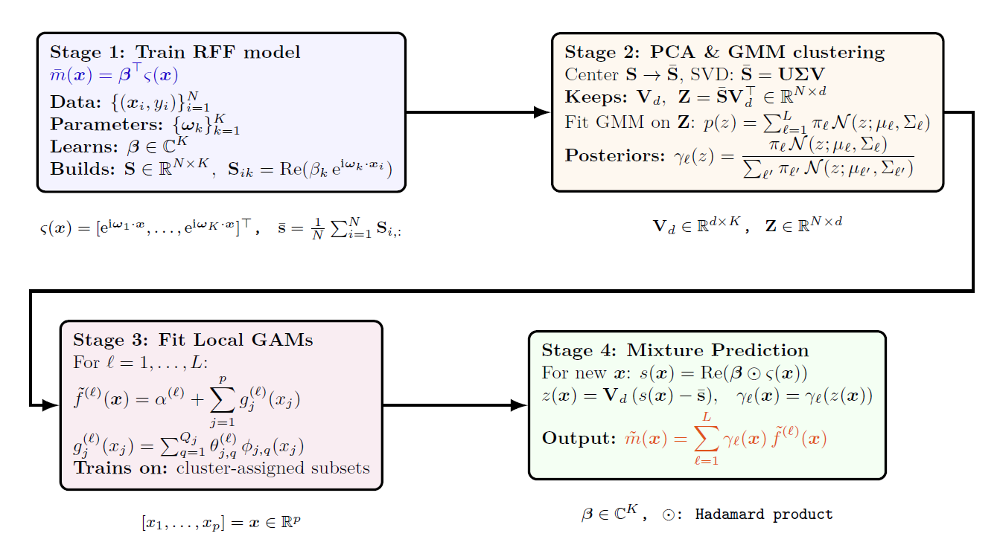
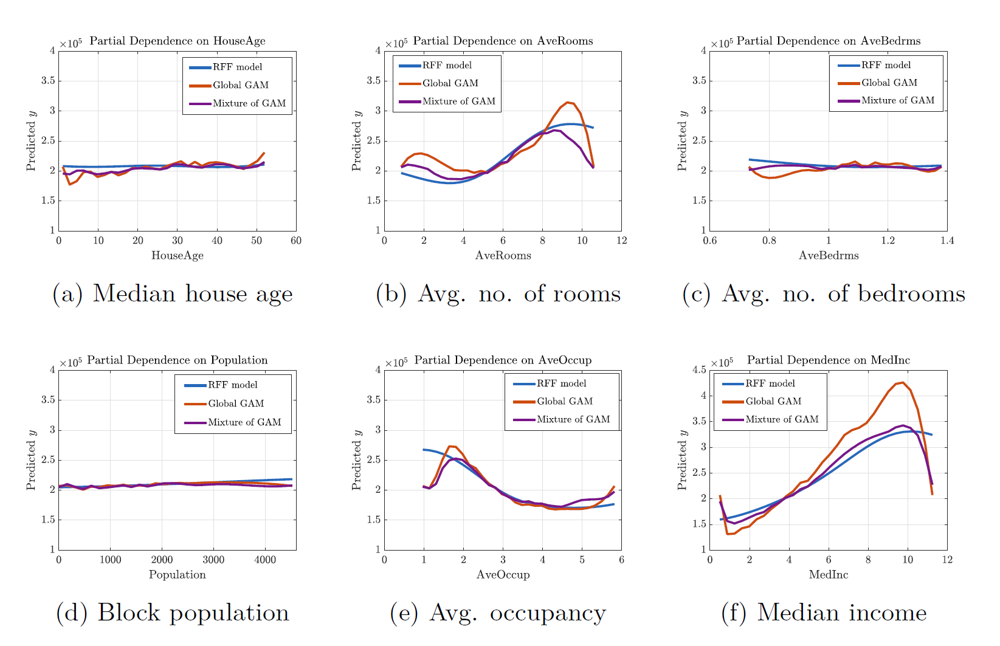
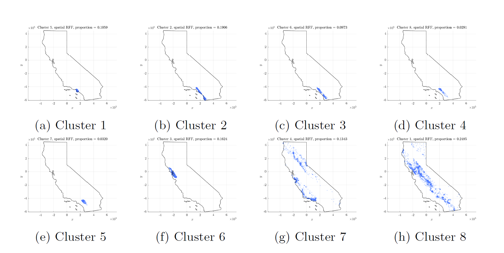
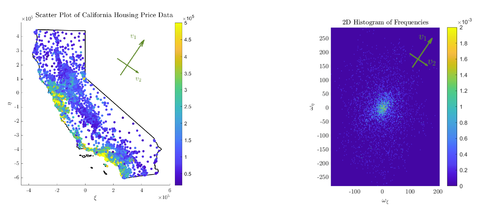
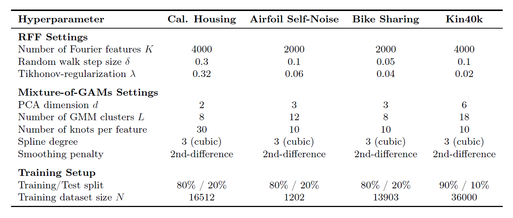

# Cluster-Based Generalized Additive Models Informed by Random Fourier Features

## 1. Overview
This repository contains the MATLAB implementation of a resampling-based Random Fourier Feature (RFF) method and the corresponding Mixture-of-Generalized Additive Models (Mixture-of-GAMs) framework for regression tasks. The goal is to combine kernel-inspired feature learning with interpretable local models to improve predictive performance while retaining explainability.

The code implements:
- **Adaptive resampling of Fourier frequencies**  
- **PCA extraction of learned spatial structure**  
- **Gaussian mixture model for soft clustering**  
- **Cluster-wise GAM fitting with smooth components**  
- **Mixture prediction using posterior responsibilities**  

The method is applied to four regression datasets:
- California Housing
- NASA Airfoil Self-Noise
- Bike Sharing
- Kin40k

---

## 2. Workflow Summary
The end-to-end workflow consists of the following steps:

1. **Train RFF Model with Resampling**  
   The frequency distribution is iteratively updated using a resampling mechanism that concentrates mass along directions capturing dominant variation.

2. **Extract RFF Embedding and Apply PCA**  
   PCA is used to identify principal directions in the learned frequency distribution, providing interpretable low-dimensional structure.

3. **Fit a Gaussian Mixture Model (GMM)**  
   The PCA embedding is clustered using a soft GMM, producing cluster responsibilities for each data point.

4. **Train Local GAMs**  
   A separate generalized additive model is fitted in each cluster using univariate smooth functions.

5. **Predict with Mixture-of-GAMs**  
   Final predictions are formed by weighting cluster-specific GAM outputs by their posterior responsibilities.

The overall proposed workflow can be visually illustrated with the following graphical diagram Figure 1.


<p align="center" style="font-size: 115%;">
  <strong>Figure 1.</strong> Diagram illustration of the workflow for the mixture-of-GAMs framework.
</p>

Figure 2 provides a schematic overview of the proposed mixture-of-GAMs workflow, highlighting the key computational stages and the features used throughout the manuscript.


<p align="center" style="font-size: 115%;">
  <strong>Figure 2.</strong> Diagram illustration of the workflow for the mixture-of-GAMs framework.
</p>

---

## 3. Results and Visualization
Figure 3 shows the partial dependence plots for the RFF model, the global GAM, and the mixture-of-GAMs. The RFF model, which attains the lowest test RMSE, serves as a benchmark for comparison. The global GAM deviates more noticeably from the RFF curves, whereas the mixture-of-GAMs provides a closer alignment and yields improved predictive accuracy.


<p align="center" style="font-size: 115%;">
  <strong>Figure 3.</strong> Partial dependence plots for selected features of California Housing
dataset.
</p>

Figure 4 displays the spatial clusters derived from the RFF embedding of the latitude–longitude features. The cluster structure aligns with the inland–coastal gradient, reflecting the dominant geographic pattern associated with housing-price variation.


<p align="center" style="font-size: 115%;">
  <strong>Figure 4.</strong> Distributions of data points for each GMM cluster in the California housing dataset, based on explainable spatial Fourier features.
</p>

We also analyze the learned spatial frequencies using a density-weighted PCA, revealing a principal direction that aligns with the inland–coastal gradient and reflects the dominant spatial pattern in the dataset, as depicted in Figure 5.

<!--

-->
<p align="center">
  
</p>
<p align="center" style="font-size: 115%;">
  <strong>Figure 5.</strong> Scatter plot of the California Housing price data and the empirical histogram of learned two-dimensional spatial frequencies, together with the principal direction of variation obtained from a density–weighted PCA.
</p>

---

## 4. Running the Numerical Experiments
The numerical implementations of the proposed Mixture-of-GAMs framework on the *California Housing* dataset can be performed by navigating to the corresponding directory and executing the main script:

```bash
cd California_Housing_dataset/matlab
run main_Cal_Housing_california.m
```

The corresponding workflow for the *NASA Airfoil Self-Noise* dataset is obtained by running:
```bash
cd Airfoil_Self_Noise_dataset/matlab
run main_Airfoil_Self_Noise.m
```

For the *Bike Sharing* and *Kin40k* datasets, the locally specialized GAM components in the mixture-of-GAMs model are trained using the Python package `pyGAM`, which is accessed through MATLAB’s built-in Python interface.

Before running the corresponding MATLAB scripts, please ensure that:

(1). A Python virtual environment (recommended Python version 3.10) with the required dependencies (in particular, `pygam` and `numpy`) is available.

(2). MATLAB is configured to use this environment via `pyenv` in out-of-process execution mode.

In our implementation, the Python environment is initialized at the beginning of the main script using `pyenv`, after which `pyGAM` is imported and used to define spline and linear terms for training cluster-specific GAM predictive functions. No additional user intervention is required once the environment path is correctly specified.

**Note:** The Python environment path in `pyenv` may need to be adapted to the local system. All other steps are handled automatically by the provided scripts.


A summary of the hyperparameter configurations for the numerical implementations on the four datasets is provided in Table 1.
<p align="center">
  
</p>
<p align="center" style="font-size: 115%;">
  <strong>Table 1.</strong> Summary of hyperparameters used for the resampling-based RFF model and the Mixture-of-GAMs framework on the California Housing, Airfoil Self-Noise, Bike-Sharing, and Kin40k datasets.
</p>


<!--
```markdown


-->
